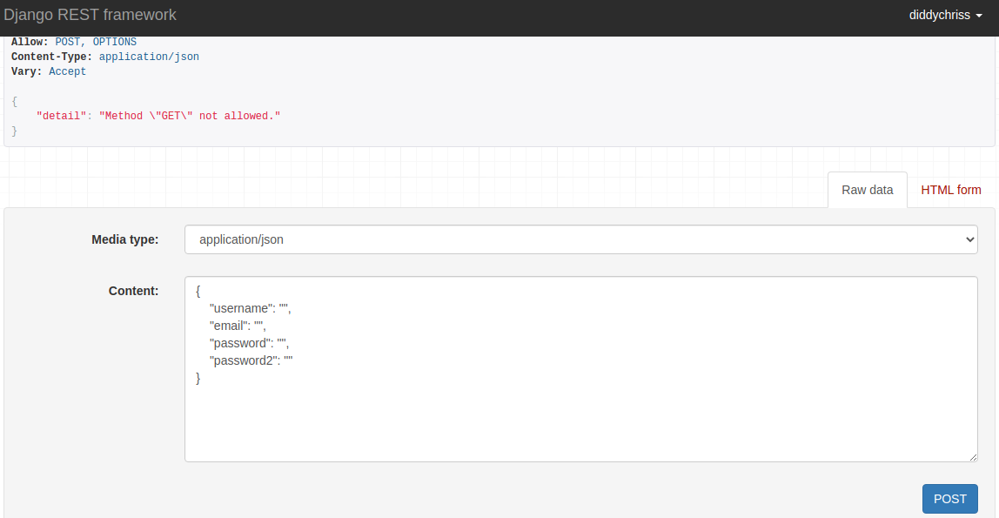
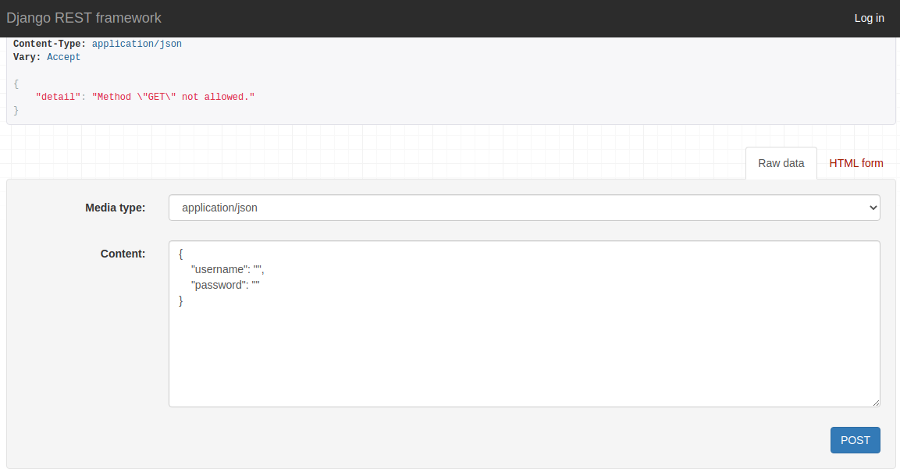
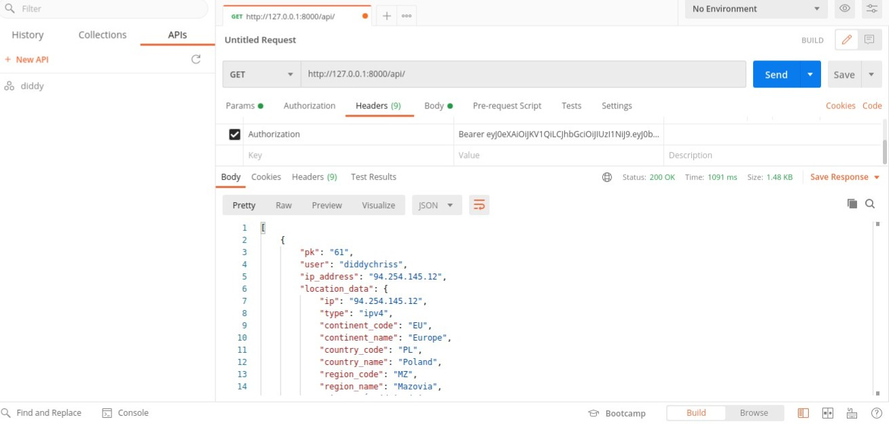

# geoApp
> Django-REST-framework App 
## Table of contents
* [General info](#general-info)
* [Technologies](#technologies)
* [Initial Setup](#initial-setup)  
* [Instruction](#instructions)
* [Live View](#live-view)
* [Status](#status)
* [Contact](#contact)

## General info
> geoApp store geolocation data in the database, based on IP

## Technologies
* Python - version 3.8
* Python Django - version 3.0.6
* Django REST Framework
* MySQL
* Docker

## Initial Setup
#### git clone repository "https://github.com/DiddyChriss/GeoApp.git"
#### Use virtualenv
#### "pip install -r requirements.txt" to install all supply software
#### "python3 manage.py createsuperuser" so you can manage Django Api UI, register as API user
#### "python3 manage.py createsuperuser" so you can manage Django Api UI or register as API user
#### Now you can add IP address and get geo data.
#### Have fun!

## Instructions
#### Login as superuser or create api user | url */register/

#### url */token/ so you can get your token for authorization:

#### now you can verify your access token in postman  */api/:

#### look at list of data  | url */api/

#### post some IP address to get geo location data:

#### geo locatioin data store in models:

## Live View
Live view available on (https://geo-app-diddychriss.herokuapp.com/) 

## Status
Finish!

## Contact
Created by [DiddyChriss] (http://chriss.pythonanywhere.com/) - feel free to contact me!
